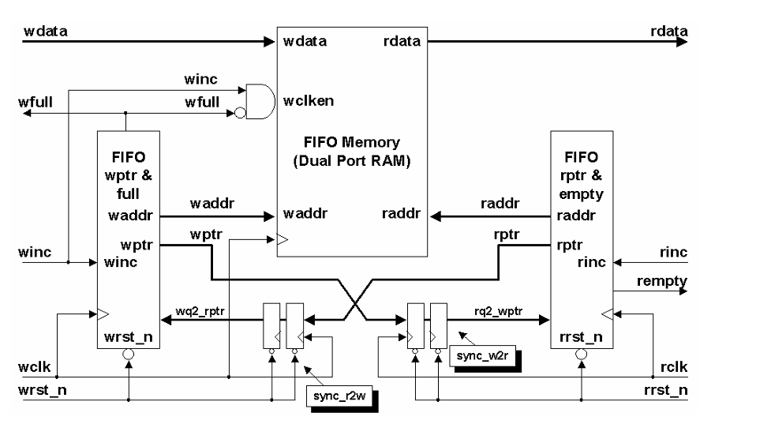
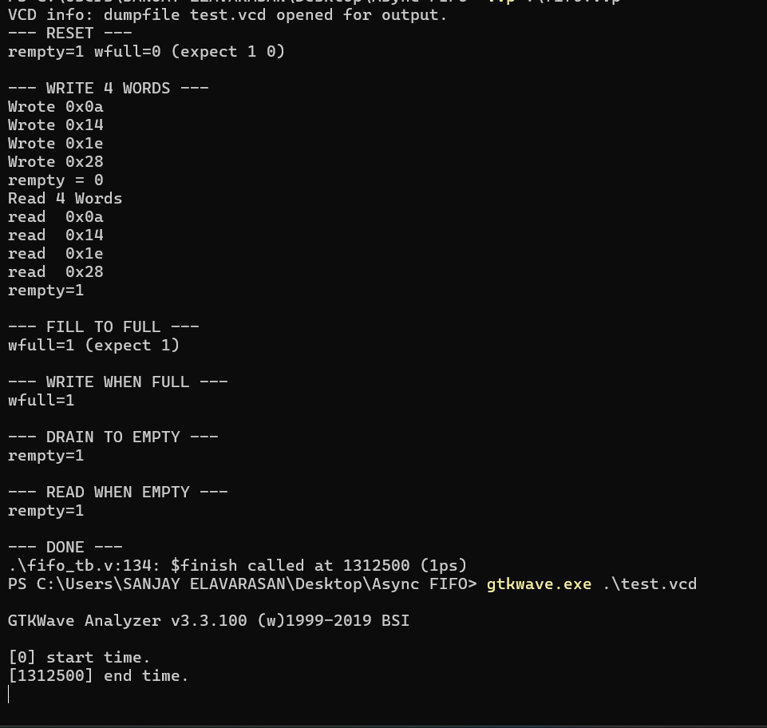
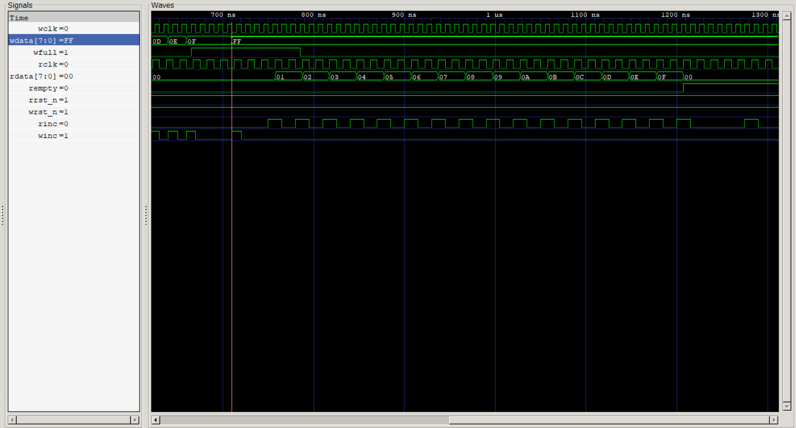
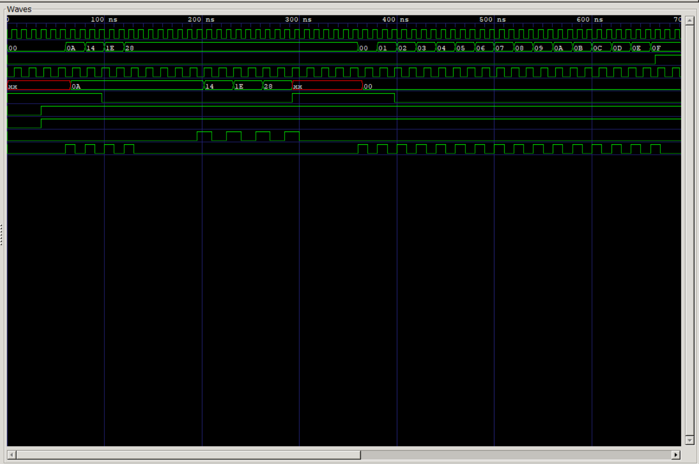
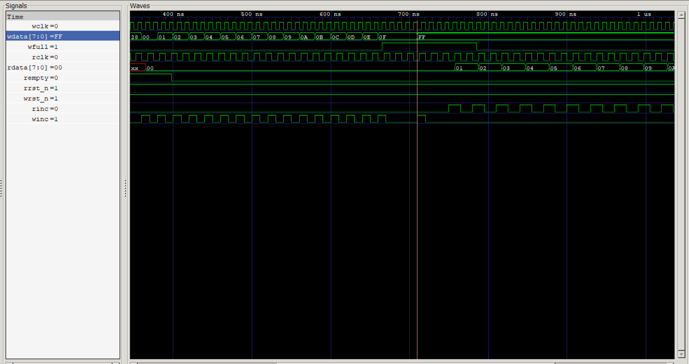
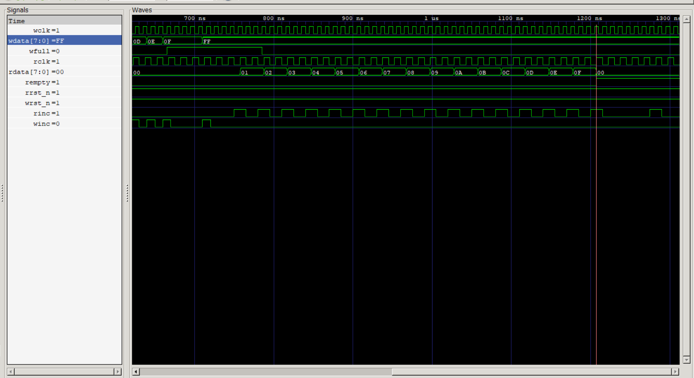

# Asynchronous FIFO Design

## Overview

An Asynchronous FIFO is used to safely transfer data between two clock domains that are asynchronous to each other (different frequencies, no phase relationship).

This design uses:

- Gray code pointers for safe CDC (Clock Domain Crossing)
- 2 Flip-Flop synchronizers to pass pointers across clock domains
- N+1 bit pointers to distinguish between full and empty conditions 
- Dual port RAM for simultaneous read and write

  ## Architecture
  

  ## OUTPUT
  
  
  ## WAVEFORM
  - When Reset is Asserted, Empty goes high and Full flag goes low.
  
  

  #
  - empty flag goes high once all data is read from the fifo memory
  
  #
  - Full flag goes high when data is loaded into all locations, and after full condition reaches even if we try to load data it is not getting loaded.
  
  #
  - Read flag goes high once data is read from all location.
  
  
  
